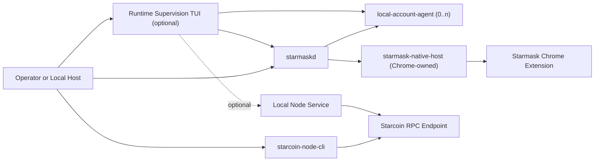
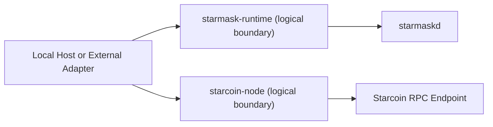

# Starcoin MCP Runtime Deployment Model

## Purpose

This document defines the repository-level deployment and runtime model for the current
`starcoin-mcp` workspace.

Status note:

- the repository no longer ships in-tree stdio adapters for `starcoin-node` or
  `starmask-runtime`
- the current chain-side executable is `starcoin-node-cli`
- the current wallet-side runtime is `starmaskd` plus backend-specific helper processes
- the current wallet runtime is Unix-only because `starmaskd` serves only Unix-domain sockets

The scope of this document is:

- `starcoin-node-cli`
- `starmaskd`
- `local-account-agent`
- `starmask-native-host`
- Starmask Chrome extension
- one configured Starcoin RPC endpoint
- an optional operator-facing runtime supervision TUI

## Design Goal

The deployment model must preserve the chain and wallet trust boundaries while making local
runtime supervision explicit.

Repository-level rules:

- chain-facing logic stays in `starcoin-node`
- wallet-facing lifecycle stays in `starmask-runtime`
- any TUI or supervisor may manage processes, but must not become a signer or a chain adapter

## Runtime Topology

### Current Repository Realization

### Logical Host-Adapter Boundary

The second diagram remains the logical boundary that higher-level host-integration documents refer
to, even though the repository currently realizes that boundary through `starcoin-node-cli`,
daemon RPC, and backend agents rather than in-tree stdio binaries.

## Current Startable Artifacts

The current repository contains these operator-relevant binaries:

1. `starcoin-node-cli`
2. `starmaskd`
3. `local-account-agent`
4. `starmask-native-host`
5. `starmaskctl`

Important distinctions:

- `starcoin-node-cli` is a short-lived command runner, not a long-lived daemon
- `starmaskd` is the long-lived wallet coordinator
- one `local-account-agent` process is required for each enabled `local_account_dir` backend
- `starmask-native-host` is launched on demand by Chrome and is not a daemon the supervisor should
  keep alive on its own

## Process Responsibilities

### `starcoin-node-cli`

- loads `starcoin-node` config and performs startup probes
- executes one chain-facing command per invocation
- prepares, simulates, submits, and watches transactions
- never signs and never owns wallet lifecycle

### `starmaskd`

- owns canonical wallet request lifecycle and persistence
- tracks backend registrations and wallet availability
- routes requests to either extension-backed or local-account backends
- survives host and helper-process restarts

### `local-account-agent`

- connects one configured `local_account_dir` backend to `starmaskd`
- handles local approval and password entry inside the backend process
- signs only after backend-local approval

### `starmask-native-host`

- is a Native Messaging bridge launched by Chrome
- forwards extension traffic to `starmaskd`
- should stay connection-scoped and stateless beyond bridge transport state

### Starmask Chrome extension

- owns browser-backed wallet state and approval UI
- signs only after browser approval

### Runtime Supervision TUI

- selects runtime profiles and start/stop actions
- launches `starmaskd`
- launches one `local-account-agent` per enabled `local_account_dir` backend
- optionally launches one local node-side service
- surfaces health, logs, and diagnostics
- never signs and never replaces `starcoin-node-cli`

## Deployment Profiles

### Wallet-Only Profile

This is the minimum current operator profile.

Properties:

- `starmaskd` is running
- local-account backends may be launched and supervised
- extension-backed backends rely on Chrome to launch `starmask-native-host`
- chain access may target an already-running local or remote RPC endpoint

### Wallet Plus Managed Local Node Profile

This is an optional convenience profile for local development.

Properties:

- the wallet profile above is active
- the TUI or another supervisor launches one local node-side service
- `starcoin-node-cli` later targets that local RPC endpoint through `node-cli.toml`

### Wallet Plus Remote Node Profile

This is also valid and often simpler.

Properties:

- wallet processes are local
- no local node-side service is launched
- `starcoin-node-cli` targets a configured remote RPC endpoint

## Startup Model

The normal current startup sequence is:

1. the operator selects a wallet config and an optional node profile
2. `starmaskd` starts and creates its runtime directories, socket, and database
3. for each enabled `local_account_dir` backend, one `local-account-agent` starts with
   `--config <path> --backend-id <id>`
4. extension-backed backends are not started directly; the supervisor checks manifest and
   connection status and waits for Chrome to launch `starmask-native-host`
5. if a managed local node profile is enabled, the supervisor launches the configured node-side
   service and waits for RPC health
6. host-side tools run `starcoin-node-cli` on demand and talk to the wallet side through an
   external adapter or direct daemon client, depending on the host integration

The supervisor should treat wallet and node startup as related but still separate tracks:

- wallet startup is mandatory for signing flows
- node startup is optional because `starcoin-node-cli` also supports remote endpoints

## Readiness Rules

The deployment model requires the following readiness checks:

### Wallet

1. `starmaskd` is ready only after its Unix socket accepts a connection and daemon health calls
   succeed
2. a `local_account_dir` backend is ready only after its `wallet_instance_id` appears in daemon
   status
3. an extension backend is ready only after Chrome has connected through `starmask-native-host`

### Node

1. a managed node-side service is ready only after its configured RPC endpoint answers health
   probes
2. readiness should use the same endpoint URL that `starcoin-node-cli` later reads from
   `node-cli.toml`
3. `starcoin-node-cli` itself should remain on-demand and should not be treated as a background
   daemon

## Shutdown Model

### Wallet Shutdown

Recommended stop order:

1. stop `local-account-agent` children first
2. stop `starmaskd`
3. do not try to keep `starmask-native-host` alive after Chrome disconnects

### Node Shutdown

- stop the managed node-side service only if the supervisor started it
- do not affect remote endpoints or shared local services the supervisor does not own

## Recovery Rules

The deployment model requires:

1. a TUI restart must be able to rediscover or adopt the processes it previously started
2. daemon restart must preserve wallet request state according to `starmaskd` recovery rules
3. backend-agent restart must preserve backend identity through stable `backend_id`
4. node-side process loss must degrade only chain access, not wallet persistence
5. browser disconnect must not be treated as request rejection

## Platform and Transport Notes

Current implementation facts:

- `starmaskd` currently supports Unix-domain sockets only
- macOS and Linux are the active wallet-runtime targets for the first TUI pass
- Windows named pipes remain a design target for a later wallet-runtime phase
- `starcoin-node-cli` consumes HTTP or HTTPS RPC endpoints and does not impose a local daemon

## Observability Requirements

The runtime model requires:

- per-process logs for `starmaskd`, each local-account agent, and any managed node-side service
- daemon diagnostics through `starmaskctl doctor`
- clear wallet-instance registration state
- clear distinction between:
  - daemon ready but no wallet backend connected
  - wallet connected but locked
  - node endpoint unavailable
  - node endpoint available but chain pins invalid

## Related Documents

- `docs/architecture/host-integration.md`
- `docs/architecture/runtime-supervision-tui.md`
- `starcoin-node/docs/deployment-model.md`
- `starmask-runtime/docs/configuration.md`
- `starmask-runtime/docs/wallet-backend-configuration.md`
