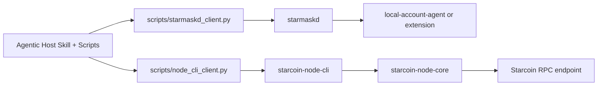

# Starcoin Transfer Workflow

This plugin example turns an agentic host into the host client for user-in-the-loop Starcoin wallet flows,
including address creation, transfer execution, and local audit tracking.

The current direction is Plan B:

- keep the host sequencing in skills and scripts
- remove direct runtime dependence on in-tree stdio adapters for the converged transfer path
- keep wallet approval outside the host session
- keep chain-side transaction logic in Rust instead of reimplementing it in Python

The design document for that direction lives at:

- `docs/plan-b-script-skill-architecture.md`

## Current Runtime Model

The converged transfer path now looks like this:



The repository still contains:

- `starcoin-node`
- `starmask-runtime`

Those source trees remain because the chain CLI reuses `starcoin-node-core` and the wallet
runtime still uses `starmaskd` plus `local-account-agent`. The plugin bundle itself no longer
ships a plugin-managed adapter entrypoint.

## Main Files

- `.codex-plugin/plugin.json`
  - plugin manifest and UI metadata
- `docs/plan-b-script-skill-architecture.md`
  - phased design for the script + skill architecture
- `hooks/hooks.json`
  - startup runtime guardrail for agentic-host sessions
- `skills/starcoin-transfer/SKILL.md`
  - transfer workflow instructions for an agentic host
- `scripts/starmaskd_client.py`
  - direct JSON-RPC client for `starmaskd`
- `scripts/node_cli_client.py`
  - adapter that calls `starcoin-node-cli`
- `scripts/run_create_account.py`
  - one-shot account-creation flow through the direct daemon path
- `scripts/transfer_controller.py`
  - typed host-side transfer controller
- `scripts/transfer_host.py`
  - host-side preflight, risk labeling, and preview helpers
- `scripts/workflow_audit.py`
  - shared JSONL audit logger for create-account and transfer workflows
- `scripts/wallet_runtime.py`
  - foreground wallet-side supervisor for `starmaskd + local-account-agent`
- `scripts/run_transfer_test.py`
  - one-shot transfer test through the direct daemon + CLI path

## Trust Boundary

The workflow still keeps the original trust split:

- `starmaskd` owns request lifecycle and wallet routing
- `local-account-agent` or the extension remains the signing authority
- `starcoin-node-cli` reuses `starcoin-node-core` for prepare, simulate, submit, and watch
- the host coordinates both sides, but does not merge them into one signer-aware runtime

## Runtime Prerequisites

The Plan B transfer path expects:

1. a valid chain-side config file for `starcoin-node-cli`
2. `starmaskd` to be running
3. a wallet backend to be registered with `starmaskd`
4. the daemon socket to be reachable

Default config locations now prefer `$HOME/.starcoin-agents`:

- node config:
  - `$HOME/.starcoin-agents/node-cli.toml`
- wallet config:
  - `$HOME/.starcoin-agents/wallet-runtime/starmaskd.toml`
- daemon socket:
  - `$HOME/.starcoin-agents/wallet-runtime/run/starmaskd.sock`

Repo-local example templates:

- `examples/node-cli.example.toml`
- `examples/starmaskd-local-account.example.toml`

`vm_profile` only affects RPC routes that have both VM1 and VM2 method names. Shared RPC such as
`chain.info`, `node.info`, and `txpool.gas_price` is profile-neutral.
`auto` is RPC routing, not per-account VM detection.
Transfer-oriented dual-surface tools such as `prepare_transfer` and `submit_signed_transaction`
follow the selected profile, while some account/resource reads may still begin on a VM1 read path
in `auto` and only use VM2 for repair or retry.
For fixed transfer semantics, prefer an explicit `vm1_only` or `vm2_only` choice plus a matching
`token_code`.
You can override the profile per host-side call with `scripts/node_cli_client.py --vm-profile ...`
or per end-to-end test with `scripts/run_transfer_test.py --vm-profile ...`.

## Isolated Dev Runtime

Keep the chain node data and signing wallet data in different directories.

Recommended layout:

- dev node data dir:
  - `<repo-root>/.starcoin-agents/devstack`
- standalone signer wallet dir:
  - `<repo-root>/.starcoin-agents/local-accounts/default`

Why:

- the Starcoin node keeps a lock on its own `account_vaults`
- `local-account-agent` must open a wallet directory independently
- reusing the node-owned wallet directory causes `LOCK: Resource temporarily unavailable`

`devwallet` was only a demo name for the standalone local account vault. It is not the wallet
runtime state directory. The runtime state belongs under `wallet-runtime/`, while local accounts
should live under `local-accounts/<name>/`. The default local-account location is now
`$HOME/.starcoin-agents/local-accounts/default`.

Example standalone wallet bootstrap:

```bash
chmod 700 <repo-root>/.starcoin-agents/local-accounts/default
starcoin --connect ws://127.0.0.1:9870 --local-account-dir <repo-root>/.starcoin-agents/local-accounts/default account create -p test123
starcoin --connect ws://127.0.0.1:9870 --local-account-dir <repo-root>/.starcoin-agents/local-accounts/default account create -p test123
```

Example funding from the dev node side:

```bash
starcoin -n dev -d <repo-root>/.starcoin-agents/devstack dev get-coin <sender-address>
```

If the wallet runtime is already up, bootstrap can also stay inside the daemon request flow:

```bash
python3 ./scripts/run_create_account.py \
  --wallet-runtime-dir $HOME/.starcoin-agents/wallet-runtime \
  --wallet-instance-id local-default \
  --account-name account-1 \
  --display-hint "Bootstrap local account"
```

`run_create_account.py` creates the request, polls `wallet_get_request_status`, prints the created
address plus the resolved account name on approval, and writes an audit record under
`$HOME/.starcoin-agents/wallet-runtime/audit/create-account-audit.jsonl` by default.

For lower-level debugging, you can still call `wallet_create_account` directly through
`starmaskd_client.py` and poll `wallet_get_request_status` yourself. To rename an existing local
address without touching the Starcoin account storage, call `wallet_set_account_label` through the
same client.

The low-level clients accept tool arguments either as stdin JSON or as a final inline JSON object:

```bash
python3 ./scripts/node_cli_client.py call get_account_overview '{"address":"<address>"}'
python3 ./scripts/starmaskd_client.py call wallet_get_public_key '{"wallet_instance_id":"local-default","address":"<address>"}'
```

Those `starcoin` CLI examples are still useful for local funding. The transfer flow itself should
use the script-driven `starmaskd` + `starcoin-node-cli` path.

## Optional Environment Overrides

Installed binaries on PATH take precedence automatically. For source-tree runs, the test path
accepts these overrides:

- `STARCOIN_NODE_CLI_BIN`
  - use an installed `starcoin-node-cli` binary
- `STARCOIN_NODE_CLI_MANIFEST`
  - override the Cargo manifest for the source-tree CLI launch
- `STARCOIN_NODE_CLI_CONFIG`
  - override the default node CLI config path
- `STARCOIN_TRANSFER_WORKSPACE_ROOT`
  - repo-relative workspace override for source-tree development
- `STARMASKD_BIN`
  - use an installed `starmaskd` binary
- `LOCAL_ACCOUNT_AGENT_BIN`
  - use an installed `local-account-agent` binary
- `LOCAL_ACCOUNT_EXPORT_BIN`
  - use an installed `local-account-export` binary for single-address private-key exports

## Wallet Runtime

Preferred local-account flow:

1. start the wallet supervisor in one terminal
2. keep that terminal open for CLI approval cards
3. run `python3 ./scripts/doctor.py`
4. run `python3 ./scripts/run_create_account.py ...`, run the host-side transfer test, or ask the agentic host to drive the workflow

If the daemon socket path exists but the doctor reports `Connection refused`, rerun:

```bash
python3 ./scripts/doctor.py --cleanup-stale-socket
```

Recommended wallet-side startup:

```bash
python3 ./scripts/wallet_runtime.py up \
  --wallet-dir $HOME/.starcoin-agents/local-accounts/default \
  --chain-id 254
```

The supervisor writes `wallet-runtime.json` under `$HOME/.starcoin-agents/wallet-runtime/` by default and keeps
`local-account-agent` attached to the current terminal so `tty_prompt` approvals still work.

To export the private key for one local account address, stop the wallet runtime first:

```bash
python3 ./scripts/wallet_runtime.py down
python3 ./scripts/wallet_runtime.py export-account --address <account-address> --output-file ./account.key
```

If `--output-file` is omitted, the command prompts for a destination file or an existing directory.
This exports only the private key for the requested address using Starcoin account export semantics;
it does not copy the full local account vault, wallet runtime socket, or sqlite state. In
non-interactive mode, pass the account password through `--password-stdin`.

## Create Account Flow

The converged wallet bootstrap flow is:

1. The agentic host or the operator resolves the target `wallet_instance_id`
2. `wallet.listInstances` through `scripts/starmaskd_client.py`
3. `request.createAccount` through `scripts/run_create_account.py` or `scripts/starmaskd_client.py`
4. wallet approval plus `request.getStatus`
5. report `result.address`, `is_default`, and `is_locked`
6. append a local JSONL audit record for request creation and the terminal decision

Recommended command:

```bash
python3 ./scripts/run_create_account.py \
  --wallet-runtime-dir $HOME/.starcoin-agents/wallet-runtime \
  --wallet-instance-id local-default
```

## Transfer Flow

The converged Plan B flow is:

1. The agentic host resolves the user transfer intent into network, sender, receiver, token, amount, and wallet instance
2. `wallet.listInstances` through `scripts/starmaskd_client.py`
3. `wallet.listAccounts` through `scripts/starmaskd_client.py`
4. `chain_status` and `node_health` through `scripts/node_cli_client.py`
5. optional `wallet.getPublicKey`
6. `prepare_transfer` through `starcoin-node-cli`
7. `get_account_overview` for sender and receiver through `starcoin-node-cli`
8. host-side preflight preview and risk labels
9. host-side confirmation
10. `request.createSignTransaction` through `starmaskd`
11. CLI or wallet approval plus `request.getStatus`
12. `submit_signed_transaction` and `watch_transaction` through `starcoin-node-cli` until the requested confirmation depth is met
13. local JSONL audit record for preview, approval lifecycle, and submit result

If the local runtime is not ready, the right recovery is to stop and run `doctor.py`, not to fall
back to direct `starcoin` CLI transfer commands.

The scripts assume the agentic host has already resolved the intent. Natural-language extraction and precise
follow-up questions remain a skill-level responsibility, not a Python parser feature.

## Audit Trail

The workflow now keeps separate default JSONL audit files for the two wallet-side flows:

- create-account:
  - `$HOME/.starcoin-agents/wallet-runtime/audit/create-account-audit.jsonl`
- transfer:
  - `<active-runtime>/audit/transfer-audit.jsonl`

Both audit files record request ids, backend ids, timestamps, and terminal decisions. The transfer
path also records the prepared payload hash and submit outcome. The audit helpers intentionally do
not log passwords, private keys, raw signed payloads, or full signed transaction bytes.

Use the summary command when inspecting audit history:

```bash
python3 ./scripts/workflow_audit.py summary \
  --path $HOME/.starcoin-agents/wallet-runtime/audit/transfer-audit.jsonl
```

Transfer runs also keep a small JSON state file next to the transfer audit by default:

- `<active-runtime>/audit/transfer-state.json`

The state file records prepared payload hashes, chain context, simulation status, and unresolved
submission hashes. It does not store raw transaction bytes or signed transaction bytes. If a prior
submit returned `submission_unknown`, the next run reconciles the persisted `txn_hash` before any
new submit attempt for the same prepared payload.

## CLI Transfer Test

Two modes are supported.

### One-shot Test

This mode starts wallet-side processes inside the test script:

```bash
python3 ./scripts/run_transfer_test.py \
  --rpc-url http://127.0.0.1:9850 \
  --wallet-dir <repo-root>/.starcoin-agents/local-accounts/default \
  --sender <sender-address> \
  --receiver <receiver-address> \
  --amount 1 \
  --amount-unit stc \
  --vm-profile vm2_only \
  --min-confirmed-blocks 3 \
  --audit-log-path <repo-root>/.starcoin-agents/transfer-audit.jsonl \
  --state-path <repo-root>/.starcoin-agents/transfer-state.json
```

### Reuse A Running Wallet Supervisor

This mode reuses an already-running wallet runtime:

```bash
python3 ./scripts/run_transfer_test.py \
  --rpc-url http://127.0.0.1:9850 \
  --wallet-runtime-dir $HOME/.starcoin-agents/wallet-runtime \
  --sender <sender-address> \
  --receiver <receiver-address> \
  --amount 1 \
  --amount-unit stc \
  --vm-profile vm2_only \
  --min-confirmed-blocks 3
```

In one-shot mode, `run_transfer_test.py` does this:

1. probes the node and derives `chain_id`, `network`, and `genesis_hash`
2. writes isolated `node-cli.toml` and `starmaskd.toml` files under a unique `.starcoin-agents/` directory
3. starts `starmaskd`
4. starts `local-account-agent`
5. talks directly to `starmaskd` for wallet discovery, request creation, and status polling
6. calls `starcoin-node-cli` for `prepare_transfer`, `node_health`, `get_account_overview`, `submit_signed_transaction`, and follow-up `watch_transaction`
7. shows a host-side preflight preview card plus risk labels before wallet signing
8. blocks immediately if the preview finds a blocking risk such as RPC unavailability or insufficient balance
9. records a prepared payload attestation in the transfer state file
10. waits for the local wallet CLI approval card in the same terminal
11. reconciles persisted unresolved submissions by `txn_hash` before any retry
12. appends JSONL audit records under the active runtime directory unless `--audit-log-path` overrides it

In supervisor-reuse mode, steps 3 and 4 are skipped. The script reads
`$HOME/.starcoin-agents/wallet-runtime/wallet-runtime.json`, reuses the daemon socket and wallet instance, and
runs the same direct daemon + CLI host flow.

`prepare_transfer.amount` is a raw on-chain integer. The test script accepts `--amount-unit stc`
for human-readable STC input and normalizes it to raw units before calling `prepare_transfer`.
`1 STC = 1_000_000_000` raw units.
If `--token-code` is omitted, the default STC token code now follows `--vm-profile`:

- `vm1_only` -> `0x1::STC::STC`
- `auto` -> `0x1::starcoin_coin::STC`
- `vm2_only` -> `0x1::starcoin_coin::STC`

The workflow does not automatically switch between `0x1::STC::STC` and
`0x1::starcoin_coin::STC`. If the connected chain expects one specific STC token code on one VM
surface, pass that token code explicitly.

Final success now also depends on confirmation depth:

- `--min-confirmed-blocks 2` is the default
- the count includes the inclusion block itself
- the default therefore means the inclusion block plus at least 1 additional observed block
- `--min-confirmed-blocks 1` means inclusion-only success

The transfer script maps that one higher-level setting onto both `submit_signed_transaction` and
`watch_transaction`, so the blocking submit path and any follow-up watch use the same semantics.

If submission is accepted but final confirmation is still missing, the script reports that as an
intermediate state and exits non-zero instead of treating it as a completed successful transfer.

`run_transfer_test.py` now also runs a host-side preflight step before wallet signing:

- `node_health` validates that the RPC path is currently usable
- `get_account_overview` provides sender balance, token visibility, and `next_sequence_number_hint`
- the preview compares the latest `chain_status` with the prepared `chain_context`
- fee and nonce context come from `prepare_transfer.execution_facts`
- blocking risks stop the flow before `request.createSignTransaction`
- nonce movement after preparation is blocking; prepare again before signing

By default the audit file is written to:

- `<runtime-dir>/audit/transfer-audit.jsonl` for one-shot runs
- `<wallet-runtime-dir>/audit/transfer-audit.jsonl` for supervisor-reuse runs

By default the transfer state file is written next to that audit file as `transfer-state.json`.

## Notes

- This plugin example is repo-local. It lives under the current workspace so you can inspect and modify it directly.
- If you want a global plugin instead, move the same files under `~/plugins/starcoin-transfer-workflow/` and mirror the marketplace entry into `~/.agents/plugins/marketplace.json`.
- In global mode, put `starcoin-node-cli`, `starmaskd`, `local-account-agent`, and `local-account-export` somewhere on PATH.
