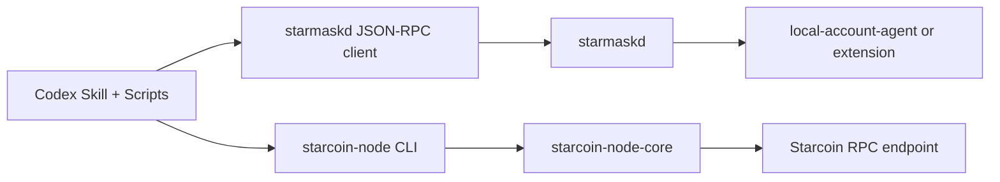

# Plan B: Script + Skill Transfer Architecture

## Status

Draft design for removing the plugin's direct dependency on in-tree stdio adapters while
preserving the existing chain-side and wallet-side trust boundaries.

This document is specific to `plugins/starcoin-transfer-workflow/`.

## 1. Problem Statement

The current transfer workflow is intentionally adapter-centric:

- the plugin manifest registers `starcoin-node` and `starmask-runtime`
- the skill tells Codex to treat those host tools as the only valid execution path
- the Python host-side controller uses tool-style calls for every step

That model works, but it makes the plugin runtime depend on two local stdio adapter binaries even
though:

- wallet-side durable state already lives in `starmaskd`
- chain-side logic already lives in `starcoin-node-core`
- the host-side transfer orchestration can already live in scripts and skills

Plan B removes the plugin's direct use of those adapter binaries and replaces it with:

- skills for host reasoning and sequencing
- local scripts and CLIs for concrete execution

## 2. Target Outcome

The plugin should support user-in-the-loop transfers without registering any in-tree adapter
binary in Codex.

The final runtime shape is:



The design keeps the existing trust boundary:

- wallet-side approval and signing remain outside Codex
- chain-side preparation and submission logic remain outside the skill text
- the host still coordinates both sides, but does not merge them into one signer-aware binary

## 3. Current Architecture Summary

Today the plugin packages:

1. `.mcp.json` to launch `starcoin-node` and `starmask-runtime`
2. one transfer skill that instructs Codex to call MCP tools in order
3. `transfer_controller.py`, which keeps transfer session state but still speaks through MCP-style
   tool names
4. `run_transfer_test.py`, which used to start both adapter binaries and drive them over `tools/call`

The current model is therefore:

- host sequencing in skill text and Python
- wallet lifecycle in `starmaskd`
- chain lifecycle in `starcoin-node-core`
- adapter binaries as mandatory runtime glue

## 4. Design Iteration And Reflection

### Reflection 1: Pure Python Chain Logic Was Rejected

One possible path was to drop `starcoin-node` entirely and reimplement:

- chain identity validation
- sequence number lookup
- gas resolution
- expiration handling
- dry-run normalization
- submission recovery
- `submission_unknown` handling
- watch polling and local rate-limit semantics

That would duplicate the logic already implemented in `starcoin-node-core` and create the
highest regression risk. Plan B therefore keeps the chain-side Rust core.

Decision:

- do not rewrite chain-side transaction orchestration in Python

### Reflection 2: A Monolithic Combined CLI Was Rejected

Another possible path was to build one binary that talks to both the node and the wallet.

That would blur the current responsibility split:

- chain-facing logic belongs to `starcoin-node-core`
- wallet-facing lifecycle belongs to `starmaskd`

Decision:

- keep separate chain and wallet adapters even after removing the in-tree adapter binaries

### Reflection 3: Wallet-Side Direct JSON-RPC Is Good Enough

`starmask-runtime` is already a thin adapter over `starmaskd`:

- account listing maps to `wallet.listAccounts`
- public key lookup maps to `wallet.getPublicKey`
- signing request creation maps to `request.createSignTransaction`
- polling maps to `request.getStatus`

`starmaskd` already owns:

- request persistence
- request idempotency
- retry-safe status polling
- wallet routing

Decision:

- remove `starmask-runtime` from the plugin runtime
- replace it with a small Python JSON-RPC client that talks to `starmaskd` directly

### Reflection 4: Chain-Side State Cannot Be Ignored

`starcoin-node-core` keeps some important state in memory:

- prepared transaction attestation records
- unresolved submission cache

If the host uses a one-shot CLI process for every node-side call, that in-memory state is lost
between invocations.

This does not fully block Plan B because:

- `prepared_chain_context` is already carried by the host
- the current transfer test config sets `allow_submit_without_prior_simulation = true`
- the host can still enforce "no blind re-submit after `submission_unknown`"

But it does mean a one-shot CLI is not a perfect semantic replacement for the MCP server.

Decision:

- Phase 1 accepts a one-shot CLI for node-side operations
- the host must treat `submission_unknown` as reconcile-first and must not re-submit blindly
- a later phase should add durable session state or a runtime-owned transfer session if strict
  parity with in-memory attestation is required

## 5. Final Design

### 5.1 Wallet Path

Add a Python wallet client that talks directly to the local daemon socket using the documented
JSON-RPC protocol.

Responsibilities:

- open one local socket connection per request
- send one JSON-RPC request
- decode one JSON-RPC response
- expose the same high-level host operations currently used by `transfer_controller.py`

Supported host-facing operations in Phase 1:

- `wallet_list_instances`
- `wallet_list_accounts`
- `wallet_get_public_key`
- `wallet_request_sign_transaction`
- `wallet_get_request_status`
- optionally `wallet_cancel_request`

### 5.2 Chain Path

Add a new standalone Rust CLI that reuses `starcoin-node-core`.

Recommended shape:

- one new crate under `starcoin-node/crates/`
- config loading reused from `starcoin-node-types`
- `AppContext::bootstrap(config)` reused from `starcoin-node-core`
- structured JSON output to stdout
- tracing and diagnostics to stderr

Supported commands in Phase 1:

- `chain-status`
- `prepare-transfer`
- `simulate-raw-transaction`
- `submit-signed-transaction`
- `watch-transaction`

### 5.3 Host Orchestration

Keep the host-side transfer orchestration in Python and skill text.

`transfer_controller.py` remains the reusable state owner for:

- prepared raw transaction bytes
- prepared chain context
- wallet request id
- approved signed transaction bytes
- submit result and watch result

The host-side workflow now has two layers:

- skill-level intent resolution
  - extract network, sender, receiver, token, amount, and wallet instance from the user's request
  - if any field is missing, ask one precise follow-up question or list concrete wallet candidates
- script-level deterministic execution
  - prepare the transaction
  - query `node_health` and `get_account_overview`
  - derive nonce, balance, fee estimate, and chain-context checks
  - generate risk labels and a transaction preview before wallet signing
  - append a minimal JSONL audit trail with request id, payload hash, backend id, and terminal decision

The controller still preserves the existing `call_tool(name, arguments)` shape even though the
underlying transport is no longer MCP, but the host contract is now broader than a pure
prepare-confirm-sign-submit-watch chain.

### 5.4 Plugin Contract

The plugin should move from:

- skill + hooks + MCP server registration

to:

- skill + hooks + scripts + CLIs

That means:

- `plugin.json` should stop requiring `mcpServers`
- the transfer skill should stop instructing Codex to call MCP tools directly
- `doctor.py` should validate script and CLI prerequisites instead of adapter launchability

## 6. Phase Plan

### Phase 1: Add The New Execution Path

Deliverables:

- direct Python client for `starmaskd`
- standalone chain CLI reusing `starcoin-node-core`
- updated `run_transfer_test.py` using the new clients
- updated design and operator docs

Compatibility posture:

- keep existing MCP binaries in the repository
- stop depending on them from the transfer workflow path

### Phase 2: Flip The Plugin Default

Deliverables:

- remove `mcpServers` from the transfer plugin manifest
- rewrite the skill to use scripts and CLIs as the canonical path
- update README and remediation text to stop describing the removed adapter binaries as the normal runtime

### Phase 3: Close Remaining Semantic Gaps

Deliverables:

- durable node-side attestation or session continuity across separate CLI invocations
- durable protection against blind re-submit after prior `submission_unknown`
- stronger end-to-end acceptance coverage for the new path

## 7. Interface Sketches

### 7.1 `starcoin-node-cli`

Examples:

```bash
starcoin-node-cli --config /path/node-cli.toml call chain_status <<<'{}'
starcoin-node-cli --config /path/node-cli.toml call prepare_transfer < /path/input.json
starcoin-node-cli --config /path/node-cli.toml call submit_signed_transaction < /path/input.json
```

Rules:

- stdout: JSON result only
- stderr: logs and diagnostics
- non-zero exit: tool failure

### 7.2 `starmaskd` Python Client

The Python client should use the daemon protocol directly:

- JSON-RPC 2.0
- one request per local socket connection
- `protocol_version = 1`

### 7.3 Controller Adapters

Both new clients should expose:

```python
client.call_tool(name: str, arguments: dict[str, Any] | None) -> dict[str, Any]
```

This preserves the host-side controller contract while allowing the transport layer to change.

## 8. Risks

### Risk 1: Node CLI Loses In-Memory Attestation Between Calls

Impact:

- no durable prepared-transaction record across CLI invocations
- no durable unresolved-submission cache across CLI invocations

Phase 1 mitigation:

- keep `allow_submit_without_prior_simulation = true`
- preserve `prepared_chain_context` in the host
- explicitly block blind re-submit in host logic after `submission_unknown`

### Risk 2: Skill Drift During Migration

If the skill is updated before the scripts and CLIs are stable, Codex may point users at a broken
execution path.

Mitigation:

- land docs and runtime path together
- keep migration staged

### Risk 3: Hidden MCP Assumptions In Operator Docs

The plugin README, TODOs, hook messages, and doctor output currently assume MCP server startup.

Mitigation:

- update operator-facing docs as part of the Phase 1 to Phase 2 transition

## 9. Implementation Decision For The First Coding Pass

The first coding pass should aim for the smallest end-to-end proof that Plan B works:

1. add this design document
2. add the direct wallet daemon client
3. add the chain CLI
4. switch `run_transfer_test.py` to the new clients
5. keep the controller structure stable

This gives the repository one real transfer path that no longer depends on the removed adapter binaries, while
leaving the deeper session-durability improvements for a follow-up phase.
