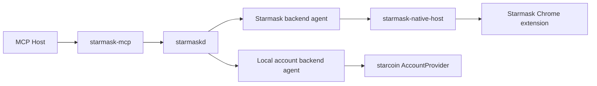
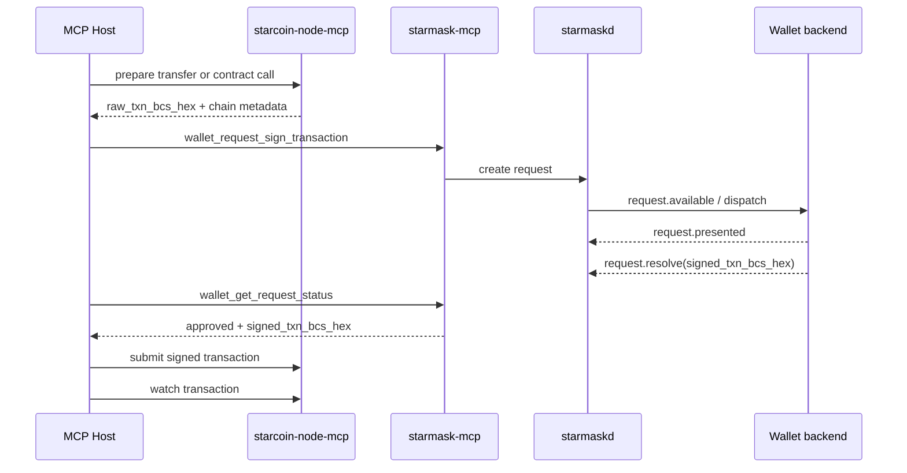

# Starmask MCP Unified Wallet Coordination Interface Design

## 1. Purpose

This document defines the first production-ready interface design for the `starmask-mcp`
stack after broadening it from an extension-only signing bridge into a unified local wallet
coordination system.

The package and binary names remain:

- `starmask-mcp`
- `starmaskd`
- `starmask-native-host`

Those names are retained for compatibility, but the architecture now supports more than one
signing backend:

- `starmask_extension`
- `local_account_dir`
- `private_key_dev`

The primary goal is to let a local MCP host request Starcoin signing operations through one
stable MCP tool surface while keeping key ownership and approval inside the selected signer
backend.

## 2. Scope

This document defines:

- runtime topology
- backend kinds and capabilities
- MCP tool surface
- coordinator routing rules
- request lifecycle
- end-to-end closed-loop flows
- performance constraints
- first-release non-goals

This document does not define:

- the exact SQLite schema
- the exact backend transport wire format
- the exact browser or desktop UI layout

Those are follow-up implementation documents and must conform to the contract defined here.

## 3. Naming and Compatibility

Historical documents described `starmask-mcp` as an adapter from MCP to the Starmask Chrome
extension. That model is now too narrow.

The updated terminology is:

- `starmask-mcp`: the MCP entrypoint and Rust adapter
- `starmaskd`: the generic local wallet coordinator
- `wallet backend`: any signer backend that registers with the coordinator
- `wallet instance`: one concrete backend session or logical signer instance

Examples:

- one Starmask browser profile connected through Native Messaging is one wallet instance
- one local account vault agent serving one account directory is one wallet instance

## 4. Design Goals

1. The MCP host talks only to `starmask-mcp`.
2. `starmaskd` owns request lifecycle and routing, but does not sign.
3. The selected wallet backend owns approval, unlock state, and signing authority.
4. Signing backends must render or validate canonical payload bytes, not trust host summaries.
5. Requests are asynchronous, durable, and idempotent through `client_request_id`.
6. Routing is deterministic and fails closed when selection is ambiguous.
7. All transports are local-only in the first release.
8. Unsupported payloads are rejected rather than blind-signed.
9. The same tool surface must work across browser and local-account backends.
10. The system must remain efficient for interactive CLI and agent workflows.

## 5. Runtime Topology

`starmaskd` is the shared coordination plane. It stores request state, tracks wallet instances,
enforces routing and TTL rules, and exposes one local daemon API. The actual signer is always a
backend agent.

### 5.1 Cross-Service Transaction Loop

`starmask-mcp` is intentionally signing-focused. Transaction preparation, simulation, submission,
and observation remain the responsibility of `starcoin-node-mcp` or another Starcoin client.

The supported end-to-end loop is:

This document treats that flow as the primary production transaction path.

## 6. Component Responsibilities

### 6.1 `starmask-mcp`

- exposes MCP tools over stdio
- validates tool inputs
- converts tool requests into daemon-client requests
- maps daemon responses into structured MCP tool outputs
- remains thin and stateless

### 6.2 `starmaskd`

- owns canonical request records
- tracks wallet instance registration and health
- resolves routing and ambiguity
- enforces lifecycle, TTL, idempotency, cancellation, and recovery
- never performs signing itself

### 6.3 Wallet backend agents

All signer backends implement the same logical contract:

- register one wallet instance
- publish account metadata and capability metadata
- claim pending work
- render local approval
- produce signatures or signed transactions
- report completion, rejection, or backend failure

### 6.4 `starmask_extension` backend

- transport: Native Messaging through `starmask-native-host`
- approval surface: browser UI
- unlock model: extension-owned
- signing authority: extension key management

### 6.5 `local_account_dir` backend

- transport: local agent socket or equivalent local IPC
- approval surface: local TTY prompt or trusted desktop prompt
- unlock model: local account password managed by the local agent
- signing authority: `AccountProvider::Local`

### 6.6 `private_key_dev` backend

- transport: local agent socket
- approval surface: local prompt or explicitly unsafe unattended mode
- unlock model: key material injected from secret file or environment
- signing authority: `AccountProvider::PrivateKey`
- production status: disabled by default and not supported for production channels

## 7. Backend Kinds and Capabilities

Every wallet instance advertises:

- `wallet_instance_id`
- `backend_kind`
- `transport_kind`
- `approval_surface`
- `lock_state`
- `connected`
- `capabilities`
- `accounts_count`
- `label`
- `last_seen_at`

### 7.1 Backend kinds

Supported first-release values:

- `starmask_extension`
- `local_account_dir`
- `private_key_dev`

### 7.2 Transport kinds

Supported first-release values:

- `native_messaging`
- `local_socket`

### 7.3 Approval surfaces

Supported first-release values:

- `browser_ui`
- `tty_prompt`
- `desktop_prompt`
- `none`

`approval_surface = none` is allowed only for explicitly unsafe development backends.

### 7.4 Capabilities

Supported first-release capability flags:

- `unlock`
- `get_public_key`
- `sign_message`
- `sign_transaction`

Backends must not advertise capabilities they cannot complete safely.

## 8. Core Domain Model

### 8.1 Wallet instance record

`WalletInstanceRecord` is the coordinator-facing description of one signer instance.

Required fields:

- `wallet_instance_id`
- `backend_kind`
- `transport_kind`
- `approval_surface`
- `protocol_version`
- `label`
- `lock_state`
- `connected`
- `capabilities`
- `backend_metadata`
- `last_seen_at`

`backend_metadata` is backend-specific and may include:

- extension ID and version for `starmask_extension`
- account directory path hint and prompt mode for `local_account_dir`
- explicit unsafe-mode marker for `private_key_dev`

### 8.2 Wallet account record

`WalletAccountRecord` represents one visible account within one wallet instance.

Required fields:

- `wallet_instance_id`
- `address`
- `label`
- `public_key`
- `is_default`
- `is_read_only`
- `last_seen_at`

### 8.3 Request kinds

Supported first-release request kinds:

- `unlock`
- `sign_transaction`
- `sign_message`

### 8.4 Request payloads

`unlock`

- target `wallet_instance_id`
- optional `account_address`
- requested unlock TTL

`sign_transaction`

- `chain_id`
- `account_address`
- `raw_txn_bcs_hex`
- `tx_kind`
- optional `display_hint`
- optional `client_context`

`sign_message`

- `account_address`
- `message_format`
- `message`
- optional `display_hint`
- optional `client_context`

### 8.5 Request results

Supported first-release result variants:

- `unlock_granted`
- `signed_transaction`
- `signed_message`
- `none`

## 9. MCP Tool Surface

The tool surface stays intentionally narrow, but it is now backend-generic.

### 9.1 `wallet_status`

Purpose:

- return coordinator health and registered wallet instance summaries

Input:

- no required parameters

Output:

- `wallet_available`
- `default_wallet_instance_id`
- `wallet_instances`
  - `wallet_instance_id`
  - `backend_kind`
  - `transport_kind`
  - `approval_surface`
  - `connected`
  - `lock_state`
  - `capabilities`
  - `accounts_count`
  - `label`
- `message`

### 9.2 `wallet_list_accounts`

Purpose:

- list visible accounts across wallet instances

Input:

- `wallet_instance_id`: optional
- `include_public_key`: boolean, default `false`

Output:

- `wallet_instances`
  - `wallet_instance_id`
  - `backend_kind`
  - `lock_state`
  - `accounts`
    - `address`
    - `label`
    - `public_key`
    - `is_default`
    - `is_read_only`

Policy:

- account listing is treated as metadata access
- backends may return cached public keys without interactive approval

### 9.3 `wallet_get_public_key`

Purpose:

- return the public key for a known account

Input:

- `address`
- `wallet_instance_id`: optional

Output:

- `wallet_instance_id`
- `backend_kind`
- `address`
- `public_key`
- `curve`

Routing rule:

- if `wallet_instance_id` is omitted and exactly one wallet instance exposes the address, the
  coordinator may auto-route
- otherwise the request fails with `wallet_selection_required`

### 9.4 `wallet_request_unlock`

Purpose:

- request that a backend unlock itself for future signing operations

Input:

- `client_request_id`
- `wallet_instance_id`
- `account_address`: optional
- `ttl_seconds`: optional requested unlock duration
- `client_context`: optional

Output:

- `request_id`
- `client_request_id`
- `status`
- `wallet_instance_id`
- `created_at`
- `expires_at`
- `message`

Rules:

- only backends advertising `unlock` may receive this request
- `starmask_extension` may return `unsupported_operation` if unlock remains wallet-owned and
  out of band
- passwords or secrets must never traverse MCP or daemon payloads

### 9.5 `wallet_request_sign_transaction`

Purpose:

- create an asynchronous signing request for a Starcoin raw transaction

Input:

- `client_request_id`
- `account_address`
- `wallet_instance_id`: optional
- `chain_id`
- `raw_txn_bcs_hex`
- `tx_kind`
- `display_hint`: optional
- `client_context`: optional
- `ttl_seconds`: optional

Output:

- `request_id`
- `client_request_id`
- `status`
- `wallet_instance_id`
- `created_at`
- `expires_at`
- `message`

Rules:

- the selected backend must advertise `sign_transaction`
- if the selected backend is locked, the coordinator fails fast with `wallet_locked`
- callers should unlock explicitly through `wallet_request_unlock`
- backends must reject unsupported or undecodable payloads instead of blind-signing

### 9.6 `wallet_sign_message`

Purpose:

- create an asynchronous message-signing request

Naming note:

- the tool name is retained for compatibility
- the operation is still asynchronous and returns a request handle, not an immediate signature

Input:

- `client_request_id`
- `account_address`
- `wallet_instance_id`: optional
- `message_format`
- `message`
- `display_hint`: optional
- `client_context`: optional
- `ttl_seconds`: optional

Output:

- `request_id`
- `client_request_id`
- `status`
- `wallet_instance_id`
- `created_at`
- `expires_at`
- `message`

### 9.7 `wallet_get_request_status`

Purpose:

- poll request state and fetch bounded retained results

Input:

- `request_id`

Output:

- `request_id`
- `client_request_id`
- `kind`
- `status`
- `wallet_instance_id`
- `backend_kind`
- `updated_at`
- `result_kind`
- `result_available`
- `result_expires_at`
- `error_code`
- `reason`
- `unlock_expires_at`: only for `unlock_granted`
- `signed_txn_bcs_hex`: only for `signed_transaction`
- `signature`: only for `signed_message`

### 9.8 `wallet_cancel_request`

Purpose:

- cancel a non-terminal request

Input:

- `request_id`

Output:

- `request_id`
- `status`
- `cancelled_at`
- `message`

## 10. Routing and Selection Rules

1. If the caller names `wallet_instance_id`, only that instance may receive the request.
2. If the caller omits `wallet_instance_id` and exactly one wallet instance exposes the target
   account and required capability, the coordinator may auto-route.
3. If the caller omits `wallet_instance_id` and multiple wallet instances match, the coordinator
   must fail with `wallet_selection_required`.
4. A backend that does not advertise the requested capability must never be auto-selected.
5. Account identity alone is insufficient when the same address appears in multiple instances.
6. Backend priority may influence `default_wallet_instance_id`, but must not silently override
   ambiguity rules.

## 11. Request Lifecycle

The shared lifecycle remains asynchronous and coordinator-owned.

Supported statuses:

- `created`
- `dispatched`
- `pending_user_approval`
- `approved`
- `rejected`
- `cancelled`
- `expired`
- `failed`

### 11.1 Dispatch rules

1. The coordinator validates and persists the request as `created`.
2. If a matching backend is online, the coordinator emits a backend-specific availability hint.
3. The backend claims work through the backend transport and receives a delivery lease.
4. Once the approval UI or prompt is actually shown, the backend marks the request as
   `pending_user_approval`.
5. The backend eventually resolves, rejects, or reports failure.

### 11.2 Presentation ownership

After a request reaches `pending_user_approval`:

- only the same `wallet_instance_id` may resume it
- the request must never migrate to a different backend instance
- disconnect alone does not imply approval or rejection

### 11.3 Idempotency rules

Creation uses `client_request_id`.

Required behavior:

- if the same `client_request_id` and the same payload are replayed, return the original request
- if the same `client_request_id` appears with a different payload hash, reject with
  `idempotency_conflict`

## 12. Supported Closed-Loop Flows

### 12.1 Wallet registration and discovery

1. The backend starts and connects to `starmaskd`.
2. The backend registers one `wallet_instance_id`.
3. The backend advertises capability, lock-state, and transport metadata.
4. The backend pushes account snapshots.
5. The backend sends heartbeats while online.
6. `wallet_status` and `wallet_list_accounts` become immediately consistent with the latest
   backend snapshot.

### 12.2 Account discovery

1. The MCP host calls `wallet_status`.
2. The host optionally filters by `backend_kind` or `wallet_instance_id`.
3. The host calls `wallet_list_accounts`.
4. The host selects a concrete `wallet_instance_id` when more than one candidate exists.

### 12.3 Unlock flow

1. The host calls `wallet_request_unlock`.
2. The coordinator routes the request to one backend instance.
3. The backend shows a local unlock surface.
4. The user approves and satisfies the backend-local unlock requirement.
5. The backend grants unlock locally and resolves the request with bounded `unlock_expires_at`.
6. Subsequent sign requests reuse that backend-local unlock window.

### 12.4 Sign transaction flow

1. The host prepares a canonical raw transaction through `starcoin-node-mcp` or another trusted
   Starcoin client.
2. The host calls `wallet_request_sign_transaction`.
3. The coordinator validates routing, TTL, capability, and lock state.
4. The backend decodes `raw_txn_bcs_hex` into canonical transaction fields.
5. The backend renders a real approval surface from canonical bytes.
6. On approval, the backend signs and returns `signed_txn_bcs_hex`.
7. The host polls `wallet_get_request_status`.
8. The host submits the signed transaction through `starcoin-node-mcp`.
9. The host watches transaction completion through `starcoin-node-mcp`.

### 12.5 Sign message flow

1. The host calls `wallet_sign_message`.
2. The backend renders the message format and canonical preview.
3. The user approves or rejects.
4. The backend returns the signature through the retained request result.

### 12.6 Cancel while approval is open

1. The host calls `wallet_cancel_request`.
2. If the request is not yet terminal, the coordinator marks it `cancelled`.
3. The backend receives cancellation and must close or disable the approval surface promptly.
4. `wallet_get_request_status` reflects `cancelled`.

### 12.7 Recovery after backend or daemon restart

1. The coordinator reloads durable non-terminal requests on startup.
2. The coordinator restores wallet instance snapshots when possible.
3. If a request had already been presented, only the same wallet instance may resume it.
4. If a request had not yet been presented, it may return to `created` and be re-dispatched to
   the same selected backend instance.
5. Expired requests move to `expired` during maintenance.

## 13. Performance and Capacity Rules

1. The coordinator must reuse backend sessions and local client handles; it must not reconnect per
   request.
2. Local-account backends must reuse one `AccountProvider` per backend instance.
3. Public metadata such as accounts and public keys may be cached; decrypted key material must not
   be cached as part of coordinator state.
4. Result retention is bounded and time-based.
5. Maintenance work such as TTL expiry and record cleanup must run incrementally.
6. The system should bound concurrent approval surfaces per wallet instance to avoid prompt floods.
7. When composed with `starcoin-node-mcp`, callers should serialize prepare-sign-submit per sender
   to avoid sequence-number conflicts.
8. Request creation and polling must remain cheap enough for interactive CLI use.

## 14. First-Release Closed Decisions

The first release is closed on these decisions:

1. Transaction signing accepts canonical `RawUserTransaction` bytes only.
2. Unsupported or undecodable transactions are rejected instead of blind-signed.
3. Passwords do not cross the MCP boundary.
4. `wallet_request_unlock` is explicit and separate from sign requests.
5. `private_key_dev` is disabled by default and must never be used in production channels.
6. There is no network listener or localhost HTTP bridge.
7. `starcoin-node-mcp` remains responsible for prepare, simulate, submit, and watch.

## 15. Non-Goals

The first release does not support:

- private key import or export through MCP
- production use of RPC-backed signer accounts
- unattended policy-based auto-signing
- silent fallback for unsupported transaction payloads
- opaque arbitrary-byte transaction signing

These may be explored later, but only if they preserve the coordinator and backend trust
boundaries defined here.
