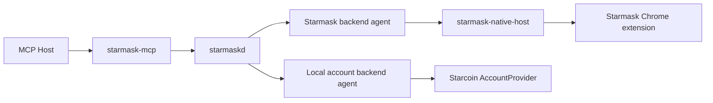

# Starmask MCP Unified Wallet Coordinator Evolution

## Status

This document records the multi-backend architecture, the implemented phase-2 baseline, and the
remaining rollout beyond that baseline.

It is not a single normative contract. Current concrete behavior remains split across:

- `docs/starmask-mcp-interface-design.md`
- `docs/daemon-protocol.md`
- `docs/security-model.md`
- `docs/configuration.md`
- `docs/wallet-backend-agent-contract.md`
- `docs/wallet-backend-local-socket-binding.md`
- `docs/wallet-backend-security-model.md`

This document exists to formally capture the multi-backend direction without pretending those
changes are already implemented.

## 1. Motivation

The original stack was effective for one signer backend, the Starmask browser extension, but phase
2 expands it to support:

- `local_account_dir` signing through a generic backend agent
- a backend-kind-aware coordinator model
- backend-local unlock during signing without exposing passwords to MCP or daemon RPC

The goal of this evolution is to preserve one stable MCP entrypoint while allowing more than one
local signing backend to participate safely.

## 2. Non-Negotiable Invariants

These invariants must remain true across every rollout phase:

1. `starmask-mcp` never signs.
2. `starmaskd` remains a coordinator, not a signer.
3. private keys remain inside the selected signer backend
4. passwords or unlock secrets never cross the MCP boundary
5. canonical payload bytes remain the source of truth for approval
6. ambiguous wallet routing fails closed

## 3. Target Architecture



The key change is conceptual:

- `starmaskd` becomes a generic wallet coordinator
- the extension becomes one backend agent
- a local account directory agent becomes another backend agent

## 4. Phase-2 Backend Model

Implemented backend kinds:

- `starmask_extension`
- `local_account_dir`

Reserved future backend kinds:

- `private_key_dev`

Implemented transport kinds:

- `native_messaging`
- `local_socket`

Approval surfaces present in shared types:

- `browser_ui`
- `tty_prompt`
- `desktop_prompt`
- `none` only for explicitly unsafe development backends

Current runtime constraints:

1. `starmask_extension` uses `browser_ui`
2. `local_account_dir` currently requires `tty_prompt`
3. `desktop_prompt` is reserved in shared enums but rejected until implemented

## 5. Current Logical Backend-Agent Contract

Phase 2 lands a backend-generic logical contract between `starmaskd` and a signer backend.

Current logical verbs:

- `backend.register`
- `backend.heartbeat`
- `backend.updateAccounts`
- `request.hasAvailable`
- `request.pullNext`
- `request.presented`
- `request.resolve`
- `request.reject`

The Native Messaging contract remains the extension-specific binding. The local-account agent now
reuses the same lifecycle semantics over the local-socket transport.

## 6. Phase-2 Data Model

### Wallet instance

Phase-2 internal fields:

- `backend_kind`
- `transport_kind`
- `approval_surface`
- `backend_metadata`
- `capabilities`

### Wallet account

Phase-2 internal fields:

- `is_read_only`

### Requests

The existing request lifecycle stays asynchronous. Phase 2 adds capability-aware routing for
backend-local unlock, while future phases may still add:

- `unlock` as a new request kind

## 7. MCP Surface Evolution

The MCP surface stays additive.

### Keep stable

These tools should remain stable:

- `wallet_status`
- `wallet_list_instances`
- `wallet_list_accounts`
- `wallet_get_public_key`
- `wallet_request_sign_transaction`
- `wallet_sign_message`
- `wallet_get_request_status`
- `wallet_cancel_request`

### Still deferred

- `wallet_request_unlock`

The current phase-2 runtime intentionally keeps unlock inside sign flows for backends that
advertise `unlock`. A standalone unlock tool must not be introduced before:

1. backends can advertise `unlock` capability
2. backend-local approval surfaces are specified
3. the daemon can reject unsupported backends deterministically

## 8. Daemon Protocol Evolution

The current daemon exposes two protocol versions with distinct roles:

- client-facing daemon RPC stays at `v1`
- generic backend-agent RPC uses `v2`

Rules:

1. keep protocol `v1` stable for the extension-backed stack
2. keep protocol `v2` scoped to backend agents until the client-facing surface actually needs a new
   contract
3. keep a written compatibility story before any later version bump

Likely future additions after `v2`:

- backend-generic wallet-instance summaries
- `request.createUnlock`

## 9. Configuration Evolution

Phase 2 replaces the extension-centric configuration with a backend list such as:

```toml
[[wallet_backends]]
id = "browser-default"
backend_kind = "starmask_extension"

[[wallet_backends]]
id = "local-main"
backend_kind = "local_account_dir"
```

The runtime now validates backend kind, transport, prompt mode, and local unlock-cache constraints
when loading this configuration.

## 10. Security Considerations for `local_account_dir`

`local_account_dir` support is viable only if these conditions are met:

1. the local account agent is the signer of record
2. account passwords are collected only inside the local agent
3. filesystem ownership and permission checks run before serving
4. approval UI comes from a trusted local prompt, not MCP chat text
5. Starcoin account-password caching is hardened or strictly bounded by short unlock TTLs

## 11. Rollout Phases

### Phase 0: current baseline

- extension-backed stack only
- daemon protocol `v1`
- no explicit unlock tool

### Phase 1: internal generalization

- add backend-kind-aware internal types
- keep external MCP and daemon contracts backward-compatible
- do not expose new tools yet

### Phase 2: local backend agent contract

- define and implement a local backend-agent transport
- specify registration, heartbeats, and request lifecycle semantics
- add configuration for `local_account_dir`
- keep backend-local password entry inside the sign flow
- keep current local backend support limited to `tty_prompt`

### Phase 3: explicit unlock flow

- add `wallet_request_unlock`
- add daemon-side capability checks
- add acceptance coverage for unlock TTL, password boundaries, and failure handling

### Phase 4: development-only private-key backend

- add `private_key_dev`
- keep it disabled by default
- block it in production channels

## 12. Phase-2 Companion Documents

The phase-2 implementation is anchored by:

- `docs/wallet-backend-agent-contract.md`
- `docs/wallet-backend-local-socket-binding.md`
- `docs/wallet-backend-security-model.md`
- `docs/wallet-backend-persistence-and-schema.md`
- `docs/wallet-backend-configuration.md`
- `docs/wallet-backend-testing-and-acceptance.md`

## 13. Practical Conclusion

Phase 2 is now real code, not only a proposal. The remaining discipline is:

1. keep the stable MCP-facing `v1` surface truthful
2. keep backend-agent `v2` behavior documented in the phase-2 companion docs
3. treat explicit unlock requests and development-only backends as future work until code and tests
   land
