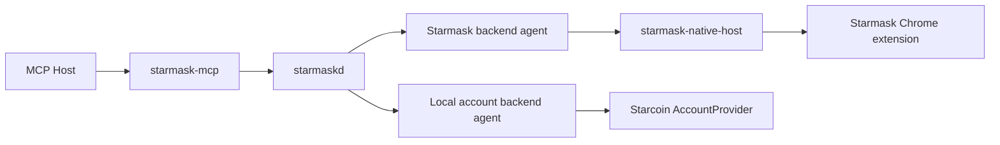

# Starmask MCP Unified Wallet Coordinator Evolution

## Status

This document is a forward-looking architecture and rollout design.

It is not the current `v1` normative contract. The authoritative `v1` behavior remains defined by:

- `docs/starmask-mcp-interface-design.md`
- `docs/daemon-protocol.md`
- `docs/security-model.md`
- `docs/configuration.md`

This document exists to formally capture the multi-backend direction without pretending those
changes are already implemented.

## 1. Motivation

The current stack is effective for one signer backend, the Starmask browser extension, but it does
not yet support:

- `local_account_dir` signing through Starcoin `AccountProvider`
- a generic signer-backend model
- explicit backend-local unlock workflows

The goal of this evolution is to preserve one stable MCP entrypoint while allowing more than one
local signing backend to participate safely.

## 2. Non-Negotiable Invariants

These invariants must remain true across every rollout phase:

1. `starmask-mcp` never signs.
2. `starmaskd` remains a coordinator, not a signer.
3. private keys remain inside the selected signer backend
4. passwords or unlock secrets never cross the MCP boundary
5. canonical payload bytes remain the source of truth for approval
6. ambiguous wallet routing fails closed

## 3. Target Architecture



The key change is conceptual:

- `starmaskd` becomes a generic wallet coordinator
- the extension becomes one backend agent
- a local account directory agent becomes another backend agent

## 4. Proposed Backend Kinds

Planned backend kinds:

- `starmask_extension`
- `local_account_dir`
- `private_key_dev`

Planned transport kinds:

- `native_messaging`
- `local_socket`

Planned approval surfaces:

- `browser_ui`
- `tty_prompt`
- `desktop_prompt`
- `none` only for explicitly unsafe development backends

## 5. Proposed Logical Backend-Agent Contract

Before any new backend ships, the project needs one backend-generic logical contract between
`starmaskd` and a signer backend.

Planned logical verbs:

- `backend.register`
- `backend.heartbeat`
- `backend.updateAccounts`
- `request.hasAvailable`
- `request.pullNext`
- `request.presented`
- `request.resolve`
- `request.reject`

The existing Native Messaging contract is the first transport binding of that logical model. A
future local-account agent should reuse the same lifecycle semantics even if its wire framing is
different.

## 6. Proposed Data Model Evolution

### Wallet instance

Planned additional fields:

- `backend_kind`
- `transport_kind`
- `approval_surface`
- `backend_metadata`
- `capabilities`

### Wallet account

Planned additional fields:

- `is_read_only`

### Requests

The existing request lifecycle stays asynchronous, but future phases may add:

- `unlock` as a new request kind
- capability-aware routing

## 7. Proposed MCP Surface Evolution

The safest path is additive.

### Keep stable

These tools should remain stable:

- `wallet_status`
- `wallet_list_instances`
- `wallet_list_accounts`
- `wallet_get_public_key`
- `wallet_request_sign_transaction`
- `wallet_sign_message`
- `wallet_get_request_status`
- `wallet_cancel_request`

### Add only after backend capability model exists

- `wallet_request_unlock`

That tool must not be introduced before:

1. backends can advertise `unlock` capability
2. backend-local approval surfaces are specified
3. the daemon can reject unsupported backends deterministically

## 8. Proposed Daemon Protocol Evolution

The current daemon protocol version is `1`. Future protocol changes should not silently mutate that
contract.

Rules:

1. keep protocol `v1` stable for the extension-backed stack
2. introduce protocol `v2` only when backend-generic fields or unlock requests are actually added
3. keep a written compatibility story before any version bump

Likely `v2` additions:

- backend-generic wallet-instance summaries
- `request.createUnlock`
- backend registration methods that are not extension-specific

## 9. Proposed Configuration Evolution

The current configuration is extension-centric. A future multi-backend config should move to a
backend list such as:

```toml
[[wallet_backends]]
id = "browser-default"
backend_kind = "starmask_extension"

[[wallet_backends]]
id = "local-main"
backend_kind = "local_account_dir"
```

That change should land only when the runtime can actually instantiate multiple backend kinds. Until
then, the current `v1` config remains authoritative.

## 10. Security Considerations for `local_account_dir`

`local_account_dir` support is viable only if these conditions are met:

1. the local account agent is the signer of record
2. account passwords are collected only inside the local agent
3. filesystem ownership and permission checks run before serving
4. approval UI comes from a trusted local prompt, not MCP chat text
5. Starcoin account-password caching is hardened or strictly bounded by short unlock TTLs

## 11. Rollout Phases

### Phase 0: current baseline

- extension-backed stack only
- daemon protocol `v1`
- no explicit unlock tool

### Phase 1: internal generalization

- add backend-kind-aware internal types
- keep external MCP and daemon contracts backward-compatible
- do not expose new tools yet

### Phase 2: local backend agent contract

- define and implement a local backend-agent transport
- specify registration, heartbeats, and request lifecycle semantics
- add configuration for `local_account_dir`

### Phase 3: explicit unlock flow

- add `wallet_request_unlock`
- add daemon-side capability checks
- add acceptance coverage for unlock TTL, password boundaries, and failure handling

### Phase 4: development-only private-key backend

- add `private_key_dev`
- keep it disabled by default
- block it in production channels

## 12. Acceptance Additions Required Before Phase 2 Freeze

Before the project can freeze a multi-backend implementation, it still needs:

1. an approved backend-generic agent contract document
2. a backend-generic security model update
3. acceptance tests for local-account permission checks
4. acceptance tests for backend-local unlock and unlock expiry
5. clear migration rules for daemon protocol versioning

The backend-generic agent contract is now captured in:

- `docs/wallet-backend-agent-contract.md`

## 13. Practical Conclusion

The multi-backend design is worth pursuing, but the disciplined path is:

1. keep current `v1` docs truthful and extension-backed
2. specify the generic backend model separately
3. promote pieces from this document into the normative docs only when code and tests actually land

That separation prevents future-state design from being mistaken for current contract.
