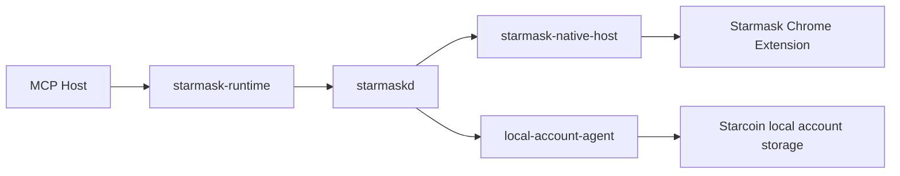

# Starmask Runtime Interface Design

## Status

This document records the host-facing adapter contract that the repository used to ship in-tree.

The `crates/starmask-runtime` adapter has been removed from the workspace. This document now serves as
design guidance for any future external adapter and should not be read as a statement that the
current repository still contains that binary.

Current implementation note:

- the current wallet daemon runtime is Unix-only
- browser-backed approval remains real, but `local_account_dir` plus `local-account-agent` is also
  current implementation rather than future-only design

Current scope is:

- `starmask-runtime`
- `starmaskd`
- `starmask-native-host`
- Starmask Chrome extension
- optional `local-account-agent`

The host tool surface remains the stable `v1` set, while `starmaskd` can now route to either the
extension backend or a configured `local_account_dir` backend.

Further evolution, including explicit unlock requests, richer backend metadata in MCP responses,
and development-only backends, is tracked separately in
`docs/unified-wallet-coordinator-evolution.md`.

## 1. Purpose

This document defines the interface design for `starmask-runtime` when deployed with the following
runtime topology:

- MCP host: Codex, Claude Code, or another local MCP-capable host
- MCP entrypoint: `starmask-runtime`
- local daemon: `starmaskd`
- browser integration: Starmask Chrome extension through `starmask-native-host`
- optional local backend: `local-account-agent`

The design goal is to provide a safe local signing entrypoint to local hosts without exposing private
key material outside the selected wallet backend.

## 2. Design Principles

1. `starmask-runtime` never holds private keys.
2. `starmaskd` never signs transactions.
3. The selected wallet backend is the only signing authority.
4. Every signing request requires explicit wallet approval.
5. Host tools interact only with `starmask-runtime`.
6. All non-host-adapter transports are local-only.
7. Requests are asynchronous by default and identified by `request_id`.
8. Request creation is idempotent through `client_request_id`.
9. The daemon fails fast when no connected wallet instance can satisfy a signing request.
10. Locked backends remain eligible for signing only when they advertise backend-local `unlock`
    capability.
11. Protocol strings stay at the boundary; typed enums and newtypes stay in core Rust types.

## 3. Runtime Topology

### 3.1 Component responsibilities

#### `starmask-runtime`

- exposes host tools to the caller
- validates tool inputs at the adapter boundary
- converts tool calls into daemon RPC requests
- returns structured results to the host

#### `starmaskd`

- maintains local request store and state machine
- tracks wallet availability and backend registrations
- routes requests between host clients and backend sessions
- enforces TTL and recovery rules
- persists state required for retries and polling

#### `starmask-native-host`

- is a Native Messaging shim launched by Chrome
- bridges extension messages to `starmaskd`
- does not implement wallet logic

#### `local-account-agent`

- loads the configured Starcoin account directory backend
- presents local approval and password prompts
- signs only after local approval inside that backend process

#### Starmask Chrome extension

- holds encrypted wallet state and unlock state
- parses Starcoin transactions and messages
- displays approval UI
- produces signatures and signed transactions

## 4. Process Model

### 4.1 `starmask-runtime`

- launch mode: on demand by MCP host
- transport: MCP over stdio
- lifetime: tied to MCP host session or tool-use pattern

### 4.2 `starmaskd`

- launch mode: long-lived user daemon
- transport to clients: Unix domain socket on macOS/Linux in the current implementation; named
  pipe on Windows remains a design target
- lifetime: user session scoped

### 4.3 `starmask-native-host`

- launch mode: on demand by Chrome via Native Messaging
- transport to extension: Native Messaging stdin/stdout
- transport to daemon: local socket or pipe
- lifetime: tied to the extension connection

### 4.4 Extension service worker

- opens a persistent Native Messaging connection while the wallet is online
- registers the current wallet instance with the daemon

## 5. Current MCP Tool Surface

The `v1` tool surface is intentionally narrow and matches the current Rust implementation.

### 5.1 `wallet_status`

Purpose:

- return current wallet availability and backend connectivity

Input:

- no required parameters

Output:

- `wallet_available`
- `wallet_online`
- `default_wallet_instance_id`
- `wallet_instances`
  - `wallet_instance_id`
  - `extension_connected`
  - `lock_state`
  - `profile_hint`
  - `last_seen_at`

`extension_connected` is the legacy field name preserved for compatibility. It indicates whether the
wallet instance is currently connected to `starmaskd`, including non-extension backends.

### 5.2 `wallet_list_instances`

Purpose:

- return known wallet instances

Input:

- no required parameters in the MCP adapter

Output:

- `wallet_instances`
  - `wallet_instance_id`
  - `extension_connected`
  - `lock_state`
  - `profile_hint`
  - `last_seen_at`

### 5.3 `wallet_list_accounts`

Purpose:

- list accounts currently exposed by configured wallet backends to the local daemon

Input:

- `wallet_instance_id`: optional filter
- `include_public_key`: boolean, default `false`

Policy:

- the current implementation does not require an interactive approval gate for account listing
- account listing is treated as local metadata access, not signing authority

Output:

- `wallet_instances`
  - `wallet_instance_id`
  - `extension_connected`
  - `lock_state`
  - `accounts`
    - `address`
    - `label`
    - `public_key`
    - `is_default`
    - `is_locked`

### 5.4 `wallet_get_public_key`

Purpose:

- return the public key for a known account

Input:

- `address`
- `wallet_instance_id`: optional

Resolution rules:

- if `wallet_instance_id` is omitted and exactly one wallet instance exposes the account, the
  daemon may auto-select
- otherwise the request fails with `wallet_selection_required`

Output:

- `wallet_instance_id`
- `address`
- `public_key`
- `curve`

### 5.5 `wallet_request_sign_transaction`

Purpose:

- create an asynchronous signing request for a Starcoin raw transaction

Input:

- `client_request_id`
- `account_address`
- `wallet_instance_id`: optional explicit route target
- `chain_id`
- `raw_txn_bcs_hex`
- `tx_kind`
- `display_hint`: optional human-readable description
- `client_context`: optional string such as `codex`
- `ttl_seconds`: optional bounded override

Output:

- `request_id`
- `client_request_id`
- `kind`
- `status`
- `wallet_instance_id`
- `created_at`
- `expires_at`

Creation policy:

- the selected wallet instance must be connected
- if that instance is locked, it must advertise backend-local `unlock` capability for signing
- the current implementation fails fast instead of queueing for later reconnect

### 5.6 `wallet_sign_message`

Purpose:

- create an asynchronous message-signing request

Input:

- `client_request_id`
- `account_address`
- `wallet_instance_id`: optional explicit route target
- `message`
- `format`
- `display_hint`: optional
- `client_context`: optional
- `ttl_seconds`: optional bounded override

Output:

- `request_id`
- `client_request_id`
- `kind`
- `status`
- `wallet_instance_id`
- `created_at`
- `expires_at`

### 5.7 `wallet_get_request_status`

Purpose:

- poll signing request state

Input:

- `request_id`

Output:

- `request_id`
- `client_request_id`
- `kind`
- `status`
- `wallet_instance_id`
- `created_at`
- `expires_at`
- `result_kind`
- `result_available`
- `result_expires_at`
- `error_code`
- `error_message`
- `result`

### 5.8 `wallet_cancel_request`

Purpose:

- cancel a pending request if it is not yet terminal

Input:

- `request_id`

Output:

- `request_id`
- `status`
- `error_code`

## 6. Routing Rules

1. If the caller names `wallet_instance_id`, only that instance may receive the request.
2. If the caller omits `wallet_instance_id` and exactly one wallet instance exposes the account,
   the daemon may auto-route.
3. If the caller omits `wallet_instance_id` and multiple wallet instances expose the account, the
   daemon must fail with `wallet_selection_required`.
4. Account identity alone is insufficient when more than one wallet instance exposes the same
   address.

## 7. Lifecycle Rules

Supported shared statuses:

- `created`
- `dispatched`
- `pending_user_approval`
- `approved`
- `rejected`
- `cancelled`
- `expired`
- `failed`

The daemon owns canonical lifecycle state. The MCP host polls through
`wallet_get_request_status`; it does not infer state from transport behavior.

## 8. Integration Note With `starcoin-node`

`starmask-runtime` is signing-focused. A typical transaction flow composes it with
`starcoin-node`:

1. prepare or simulate an unsigned transaction through `starcoin-node`
2. create the signing request through `starmask-runtime`
3. poll for `approved` and extract the signed transaction
4. submit and watch the transaction through `starcoin-node`

That composition is the recommended operational pattern, but it is outside the `starmask-runtime`
tool contract itself.

## 9. Deliberate `v1` Omissions

The current implementation does not define:

- backend-kind metadata in MCP tool responses
- `private_key_dev` support
- `wallet_request_unlock`
- blind signing

Those topics are intentional follow-up work and are specified separately in
`docs/unified-wallet-coordinator-evolution.md`.
